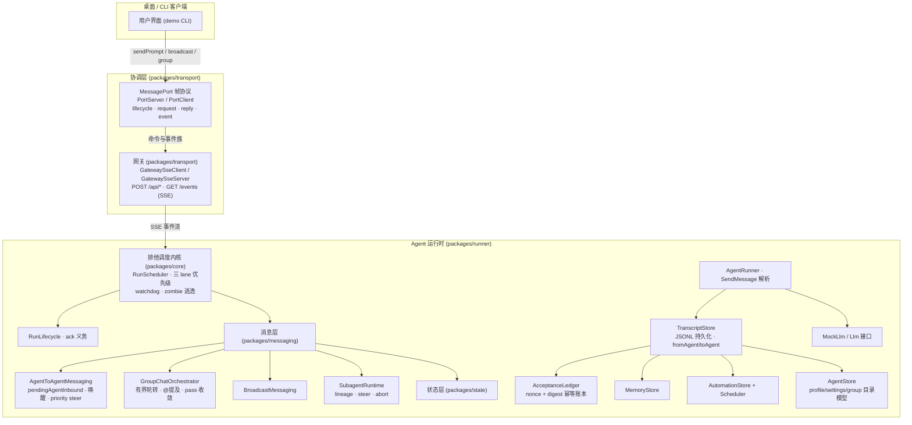

# Open-Grokbot

开源的多 agent 通信与协调框架 —— 对现代桌面 agent 平台（Grok Bot 类）架构的**全量还原实现**。
以逆向工程得到的架构为蓝图，完整重建其多 agent 系统的每一层：进程通信、排他调度、消息协议、群聊编排、幂等账本与持久化状态。

> 本仓库为独立实现。Grok Bot、Cursor 及其相关名称、商标归其各自所有者所有；本项目的代码、命名与文档仅作架构研究与工程参考。

## 架构总览



## 快速开始

```bash
npm install
npm run build          # 全量构建（tsc 项目引用）
npm test               # 全量测试（node:test）
npm run demo           # 运行完整演示：用户对话 + A2A + 群聊 + 广播
```

演示输出示例：

```
--- 2. agent-to-agent: Alpha -> Beta ---
  ack: Sent to Beta. This is asynchronous; ...
  [beta/send-message] Thanks for the note, Alpha! I'll take a look.

--- 4. group chat: Squad discusses the roadmap ---
  [squad/group] Alpha: good point — @Beta what do you think?
  ...
```

## 包结构

| 包 | 职责 | 对应原版 |
|---|---|---|
| `@open-grokbot/core` | 排他运行队列（三 lane 优先级）、watchdog 逃逸、run 生命周期、重试/期限/空闲策略、事件总线 | dune scheduling + RunScheduler/RunLifecycle |
| `@open-grokbot/transport` | MessagePort 帧协议（会话/违约/结算）、HTTP+SSE 网关（客户端与服务端）、16 事件族映射 | renderer-port-server / gateway-client / gateway-server |
| `@open-grokbot/state` | transcript（JSONL）、acceptance 幂等账本、memory、automations、agent 目录存储 | transcript / send-acceptance / memory / automations |
| `@open-grokbot/messaging` | A2A 私聊（队列+唤醒+优先级中断）、群聊编排、广播、subagent 运行时 | agent-to-agent-messaging / group-chat-orchestrator / background-wakes / subagent-runtime |
| `@open-grokbot/llm` | LLM 抽象 + 规则驱动 mock | chat-inference 适配层 |
| `@open-grokbot/runner` | turn 执行（SendMessage 提取）、SessionRuntime 装配根、GroupMemberRunner | sand-agent-runner / host 组合根 |
| `@open-grokbot/demo` | CLI：chat / a2a / group / broadcast / transcript | — |

## 核心机制

- **排他运行队列**：每个 agent 一个队列，同一时刻一个活跃 turn；`user > agent > background` 三 lane 优先级，用户消息永远最先。
- **watchdog 逃逸**：卡死 run 进入 grace 窗口后被逃逸为 zombie——调用方 promise 立即返回（发送永不悬挂），删除/排空仍等待其真正结束。
- **A2A 消息**：fire-and-forget + 对称唤醒；priority 消息可中断接收方非用户工作（steer）；DM 抢占后 at-least-once 重驱（isRedriven 防环）；双侧 transcript 镜像 + 社交图谱。
- **群聊编排**：有界轮转（消息上限/轮次上限/全员 pass 收敛/用户消息 supersede），@提及路由，每成员独立会话状态。
- **幂等发送**：clientNonce + inputDigest 持久化账本，超时重试零双发；durable acceptance 使发送与执行解耦。
- **广播**：用户→全员单向扇出，顺序调度、并发执行、无环。
- **subagent**：父 agent 派生的后台 run，lineage 世系、steer 转向、abort 中止。
- **持久化**：每 agent 独立目录（transcript.jsonl / memory.json / automations.json / profile.json / settings.json / group.json）。

## 文档

- [架构文档](docs/architecture.md) —— 分层、数据流、消息路径
- [协议规范](docs/protocol.md) —— 帧协议、SSE wire、A2A/群聊/广播契约、幂等账本

## 测试

```bash
npm test
```

覆盖：lane 优先级、排他性、watchdog 逃逸与 drain、端口协议违约、SSE 重连与 sendPrompt 幂等重试、transcript 持久化、账本去重/摘要不匹配/重启存活、A2A 唤醒/优先级中断、群聊收敛/上限、广播、subagent 生命周期、端到端（用户→agent、A2A 唤醒回复、群聊）。

## 路线图

- [ ] 协调器子进程（utilityProcess 三端口 + carrier）
- [ ] 跨用户共享房间（xuser relay 协议）
- [ ] 云 agent 桥（BackgroundComposer gRPC）
- [ ] 真 LLM 接入（OpenAI/Anthropic 兼容）
- [ ] Web UI（transcript 渲染、群聊视图、社交图谱）
