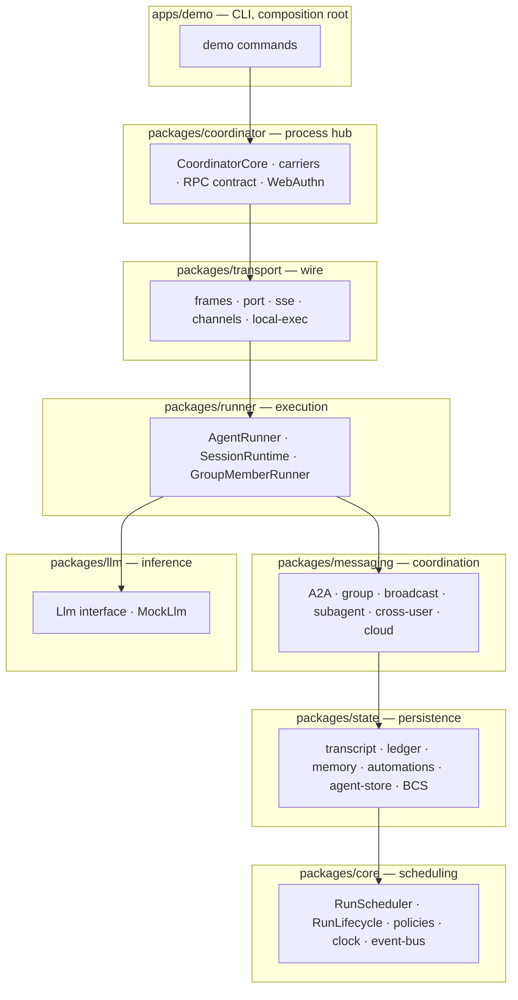
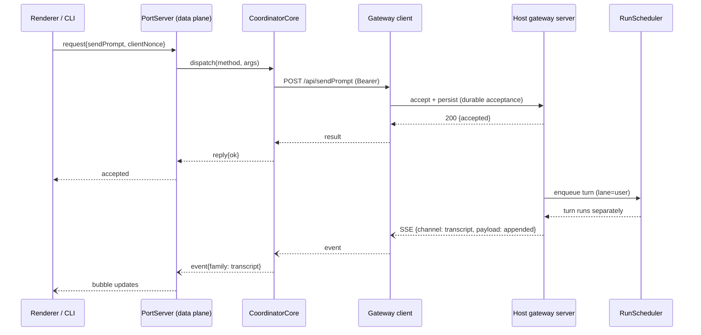
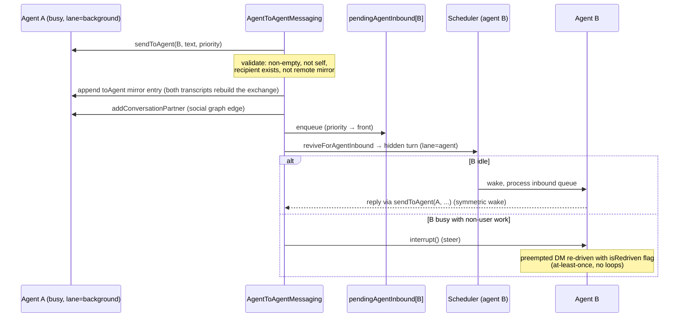
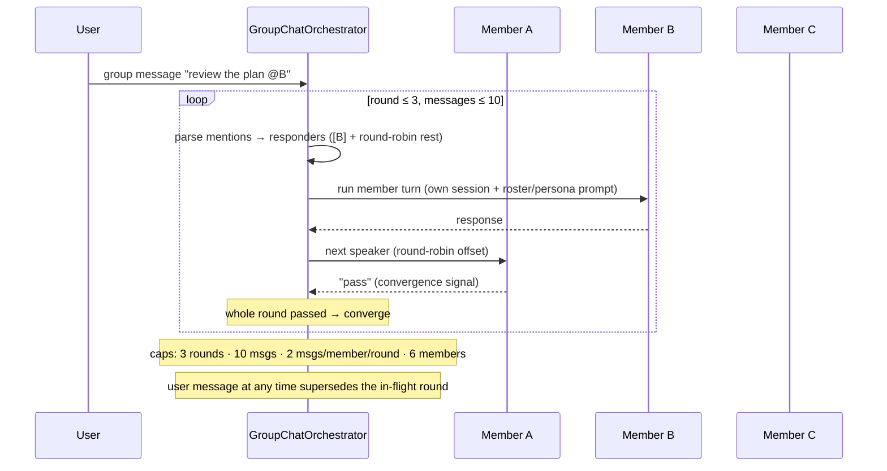
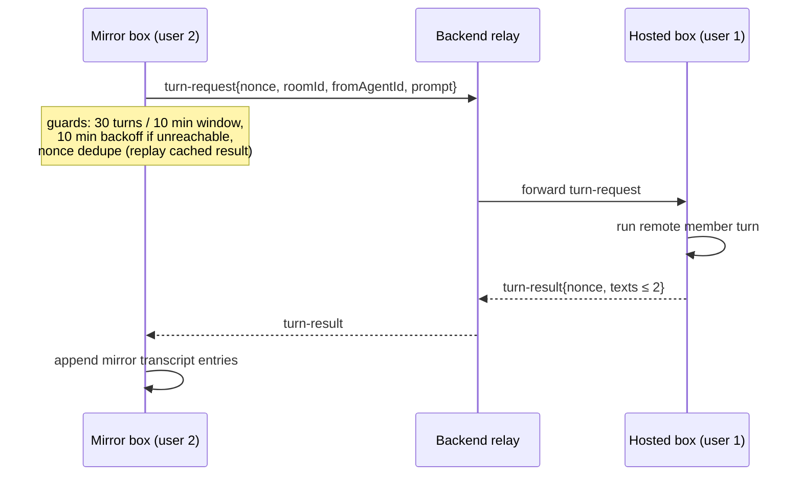
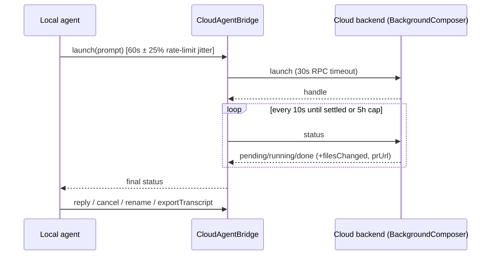
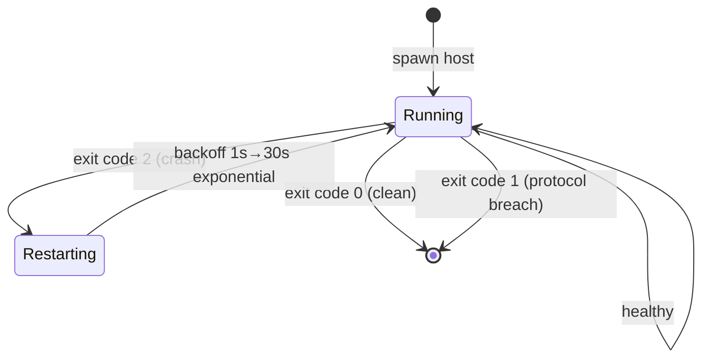

# Architecture

English documentation for Open-Grokbot — a clean-room re-implementation of a
modern desktop agent platform's multi-agent communication and coordination
architecture.

## 1. Process Topology

The original platform splits responsibilities across OS processes: an
Electron shell (renderer + main), a **node-agent-coordinator** utility
process (the IPC hub), a **host** agent runtime, and a **local-exec-daemon**
for isolated shell execution. Open-Grokbot mirrors this topology; in plain
Node the shell is a CLI demo and the coordinator runs as a forked child.

```mermaid
flowchart LR
    subgraph Shell["Desktop shell (Electron main + renderer) / demo CLI"]
        UI["Renderer / CLI"]
        MAIN["Main process"]
    end

    subgraph Coord["node-agent-coordinator (child process)"]
        C["CoordinatorCore"]
        S1["control session"]
        S2["data session (renderer)"]
        S3["mainData session (main)"]
        GW["Gateway SSE client"]
        HV["host supervisor"]
    end

    subgraph Host["Host (agent runtime)"]
        H["orchestration: transcript · scheduler · messaging"]
    end

    subgraph Exec["local-exec-daemon"]
        E["shell / file ops"]
    end

    UI -->|MessagePort | S2
    MAIN -->|MessagePort | S3
    MAIN -->|MessagePort | S1
    S1 --- C
    S2 --- C
    S3 --- C
    C -->|POST /api/&lt;method&gt;| GW
    GW <-->|GET /events (SSE)| H
    HV -.->|spawn / restart| Host
    H <-->|HTTP /local-exec/*| E
```

Carriers (mirroring the original's two boot paths):

| Carrier | Process | Transport | Planes |
|---|---|---|---|
| parent-port (production) | `utilityProcess.fork` | 3 × `MessageChannel` handed off in one `handoff` message | control / data / mainData |
| fork-ipc (tests, plain Node) | `child_process.fork` | one IPC pipe, `{channel}` envelope | control / mainData (no renderer) |

## 2. Layering



Dependency direction is strictly downward; no layer reaches up.

## 3. Command & Event Data Flow



The acceptance reply only promises durability; the turn executes
independently (durable-acceptance decoupling).

### Event-family pipeline

```
host SSE channel ──► coordinator family map ──► port event frame ──► renderer
        │                      │                        │
  16 channels           16 typed families           family-tagged
  ?channels= filter     unknown → passthrough       per-family handlers
```

The 16 families: `transcript`, `agents`, `agent-upserted`, `tray`,
`workflows`, `subagents`, `async-tasks`, `automations`, `mcp-servers`,
`forever-box`, `teach-recording`, `box-disk-pressure`, `computer-action`,
`outline`, `sharing`, `host-settings`. Unknown channels pass through
untouched so protocol evolution never breaks the pipeline.

## 4. A2A Messaging Path



Fire-and-forget: the sender never blocks on a reply; replies wake the
original sender symmetrically, so no deadlock is possible.

## 5. Group Chat Orchestration



## 6. Cross-User Shared Rooms



## 7. Cloud Agent Bridge



## 8. State & Consistency

- **Transcript**: JSONL per agent (mirroring the SQLite + in-memory dual
  track); user/assistant/a2a/tool entries with `fromAgent`/`toAgent` markers
  so both sides of an exchange can rebuild the full conversation graph.
- **Acceptance ledger**: persistent nonce + input digest store; retries after
  crash/timeout replay the stored acceptance instead of double-sending.
- **BCS sync**: etag conditional writes, exclusive mutation lock with expiry,
  merge-on-conflict retry — two devices editing one agent converge.
- **Agent store**: per-agent directory (profile.json / settings.json /
  group.json / store.db-equivalent JSON files), 50-agent cap, 6-member group
  cap.

## 9. Supervision & Recovery



- SSE client: connect deadline 15s, stall watchdog 35s, send timeout 15s,
  1s→10s capped backoff, infinite reconnect, re-seeded roster.
- Scheduler watchdog: wedged runs escape after 120s + 30s grace into a
  zombie — callers settle immediately, drain/delete wait for true stop.
- Port protocol: any frame contract breach settles the session and the
  coordinator kills by exit-code contract.
